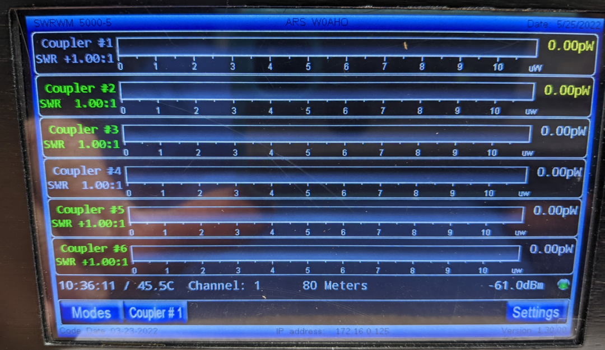
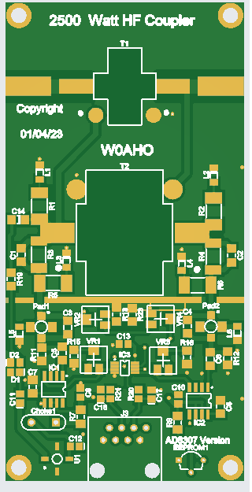
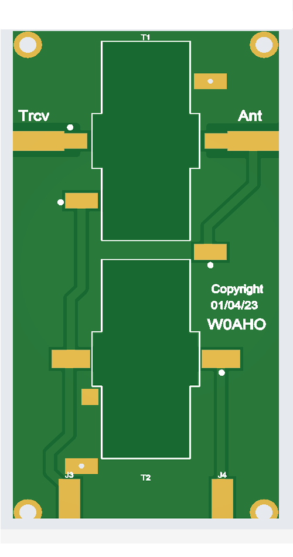
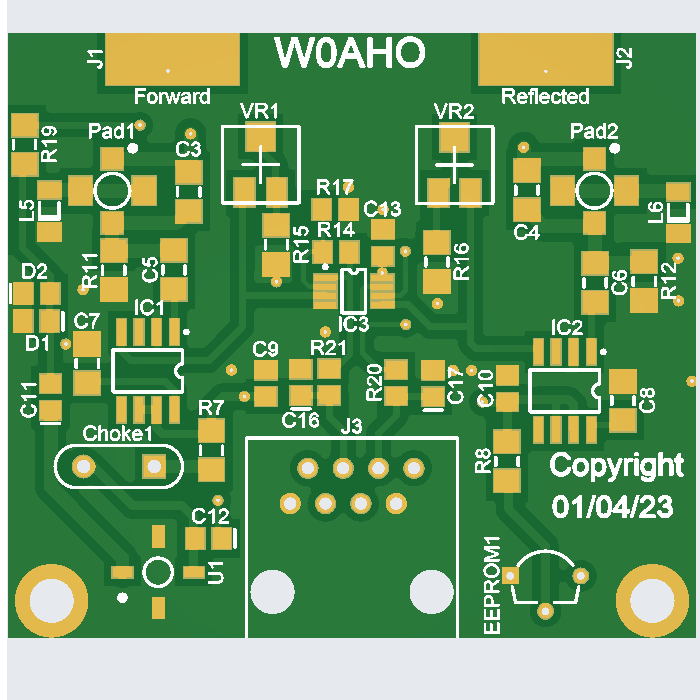
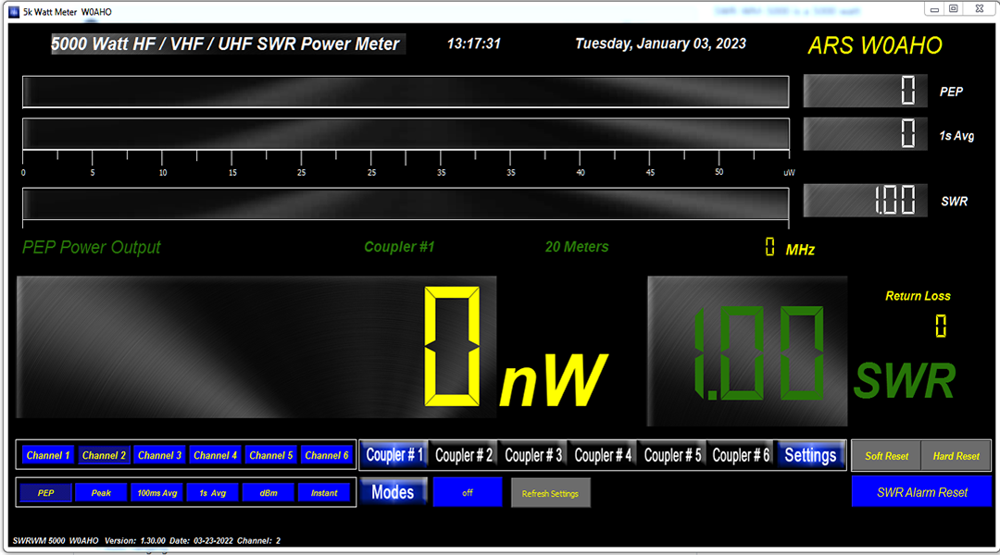
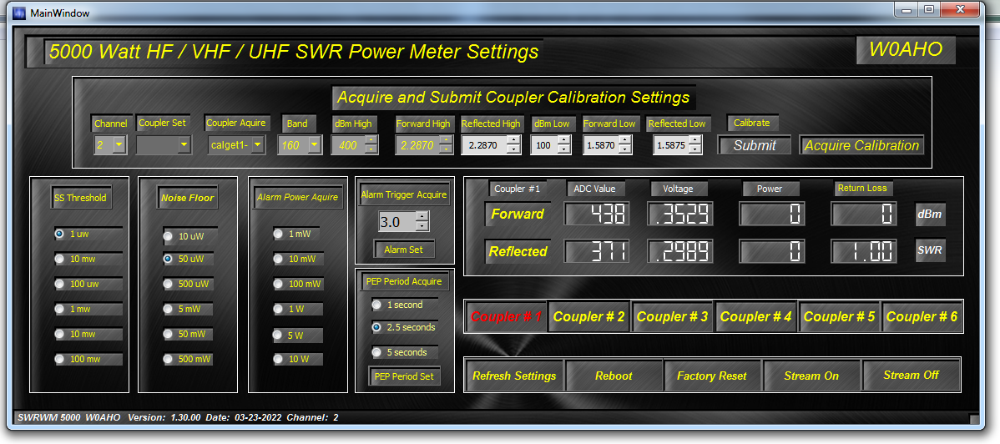

# SWR-WM-5000
## Home Brew project from W0AHO

ATTENTION!!    I have been trying to generate some interest in this Watt Meter.  Either I am not doing it correctly or there is just not any interest in it.  I don’t receive any email, or no one is following.

With that being said, I will be removing this repository on Friday January 13th.

Thanks

73

Tim W0AHO

Update ----- Circuit boards have arrived.  Now to start assembly 01/06/2023

Update----- Circuit boards are ordered and have been shipped. 12/28/22

This is a work in progress, additions will be made constantly 

SWR-WM-5000 is a 5000 watt UHF/VHF/HF SWR watt meter based on the Teensy 4.1 development board.

 7" and 5" TFT Screens with Capacitive touch 

 Capable of simultaneously forward and reflected power from six  power Couplers/SWR Bridges

 UHF/VHF/HF Coupler/Bridges

 Easy to use graphics UI

 USB and WIFI connections

 PEP selections for 1, 2.5 and five second hold times

 Auto ranging

 GUI can monitor all six Couplers  simultaneously

# Watt Meter Circuit Boards

 Watt Meter Control

The Watt Meter Control board contains the Teensy 4.1 connections

3V3 power supply

40 pin FFC for connection to the TFT readout

40 pin FFC connection to the Input Module #1.

 Input Module #1

The Input Module #1 provides input from a 12 Vdc Power Supply, 2 HF, VHF or UHF couplers

Two O/I's for Alarms, coupler #1 and Coupler #2

ESP8266 WIFI card

USB connection

 Input Module #2

The Input Module #2 privides input from coupler #3, #4, #5 and #6

Four I/O's for Alarms, Coupler #3 to #6.

 Power Switch and LEDs

Power Switch and LEDs are provided along with a 24 detented Encoder

The LED's provide indications of Band, and couplers connected

# Coupler Circuit Boards

 Three different Couplers
    
     2500 watt HF coupler
    
 
    
     5000 watt HF coupler
    
 
 
    
     5000 watt VHF/UHF coupler
    
    
 Each individual coupler contains calibration points

     13 interpolated coupler calibration points

# Ethernet Connection Computer program
## Screen Shots

Watt Meter screen

   

Settings screen

